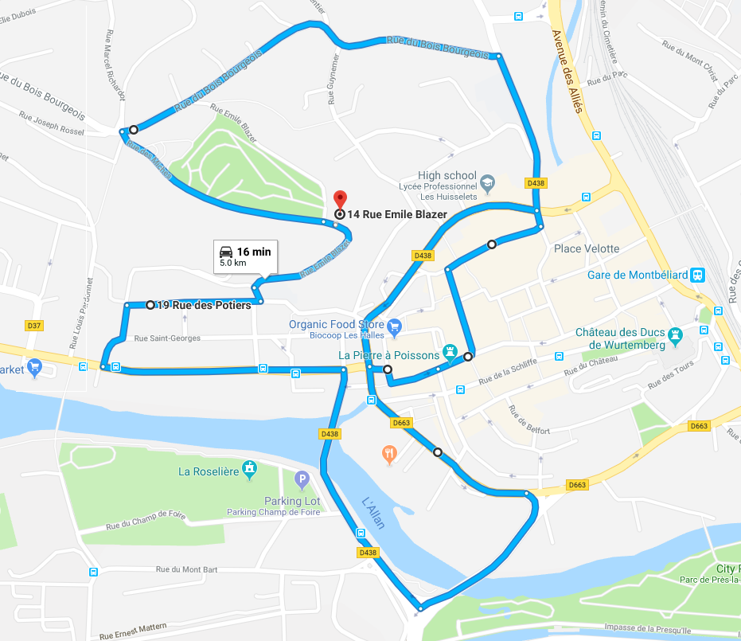
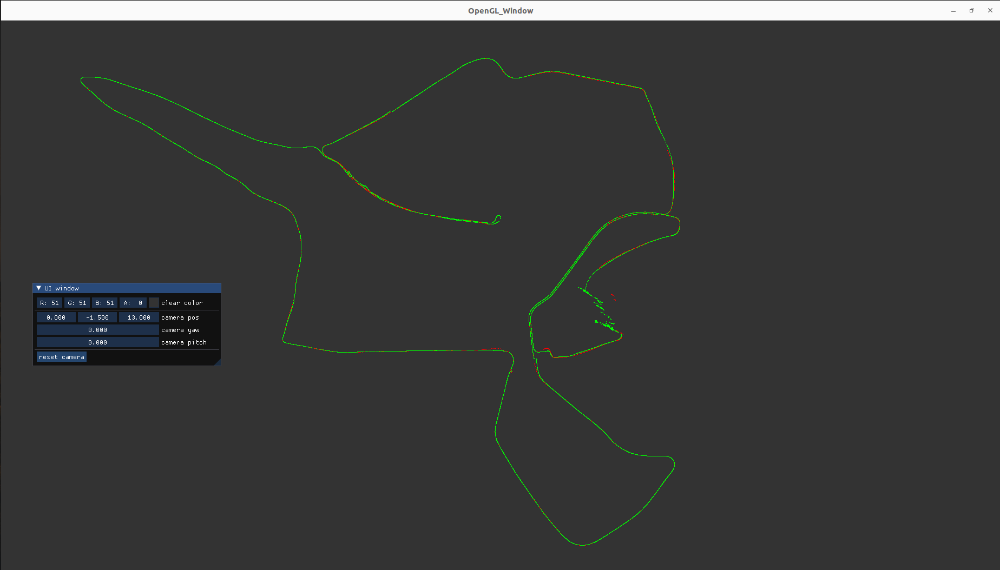

# ESKF BASED GNSS-IMU LOCALIZATION

## Installation

### Dependencies
- Ubuntu 20.04
- ROS2(foxy)
- Eigen3
- GeographicLib
- OpenGL
- nmea_msgs(ROS package)
- nmea_navsat_driver(ROS package)

### Install EU Long-term Dataset with Multiple Sensors for Autonomous Driving
[EU Long-term Dataset with Multiple Sensors for Autonomous Driving](https://epan-utbm.github.io/utbm_robocar_dataset/)

- Download [2019-01-31 (Fri, snow) None Image rosbag](https://drive.utbm.fr/s/JoB5gHwaEfDA8ga)



### Convert rosbag1 to rosbag2

- [rosbag convert](https://ternaris.gitlab.io/rosbags/topics/convert.html)

```bash
rosbags-convert utbm_robocar_dataset_20190131_noimage.bag
```

### Clone the repository
```bash
cd /your/workspace/src
git clone https://github.com/LimHaeryong/eskf-gnss-imu-localization.git
```

### Modify rosbag path
- modify launch/eskf_gnss_imu_localization.launch.py
```python
    play_rosbag = ExecuteProcess(
        cmd=['ros2', 'bag', 'play', 'change/to/your/rosbag/path']
    )
```

### Colcon Build
```bash
cd /your/workspace
colcon build
source ./install/local_setup.bash
```

## How to run   
```bash
ros2 launch eskf_gnss_imu_localization eskf_gnss_imu_localization.launch.py 
```

## Result
- GNSS position(Red)
- Filtered position(Green)



